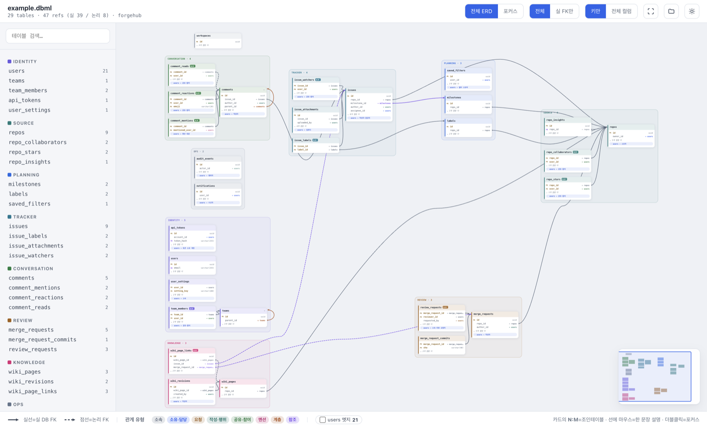
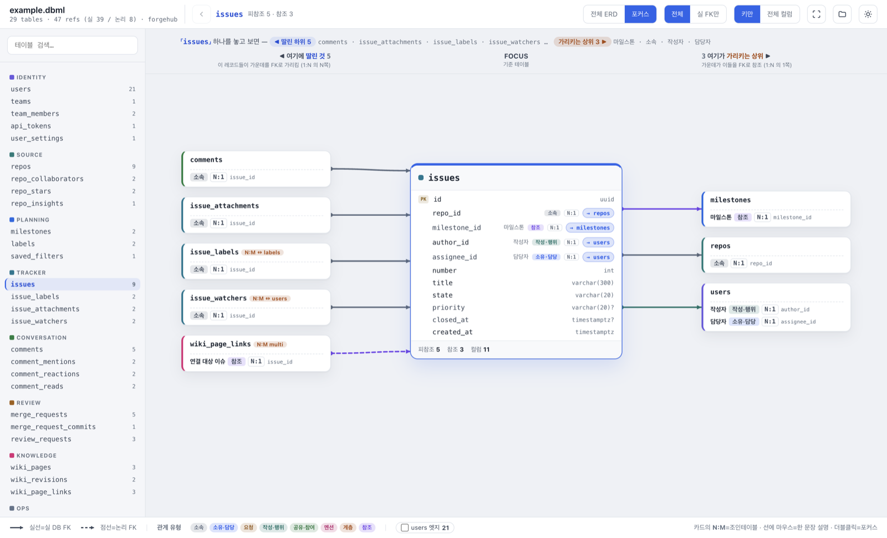

# schema-lens

A desktop ERD explorer for [DBML](https://dbml.dbdiagram.io/) schemas, built with Electron.

schema-lens renders your whole schema as one readable diagram — relationships are
classified by meaning, person-reference edges fold away instead of turning the graph
into spaghetti, and a dedicated focus mode lets you walk the schema one table at a time.

<picture>
  <source media="(prefers-color-scheme: dark)" srcset="docs/erd-dark.png">
  
</picture>

## Install

**Download (macOS)** — grab the latest DMG from
[Releases](https://github.com/HwangBBang/schema-lens/releases) (universal binary).

The app is not code-signed, so the first launch triggers macOS Gatekeeper — either
right-click the app and choose **Open**, or clear the quarantine flag:

```bash
xattr -cr /Applications/schema-lens.app
```

**Run from source (any platform)** — requires Node.js:

```bash
git clone https://github.com/HwangBBang/schema-lens.git
cd schema-lens
npm install
npm start                       # restores the last opened file
npm start assets/example.dbml   # or open the bundled example right away
```

More dev commands (tests, packaging) are under [Getting started](#getting-started).

## Why

Auto-generated ERDs stop being useful at around 20 tables: every table references
`users`, every edge crosses every other edge, and the actual structure drowns.
schema-lens addresses this in three ways:

- **Semantic edge classification** — every foreign key is typed as one of eight
  relationship kinds (composition, ownership, request, authorship, sharing, mention,
  hierarchy, reference), inferred from column-name patterns, `ON DELETE` rules, and
  PK membership. Edges stay neutral gray until you hover or select — then the
  relationship's color and a one-sentence explanation appear, so the diagram reads
  calmly at rest but explains itself on demand.
- **Hub folding** — when most inbound edges of a high-degree table are
  person-references (the `users` table in almost every schema), those edges are
  hidden by default and summarized as compact chips on each card. What remains
  visible is the structural skeleton. Folded hubs can be toggled back per hub.
- **Obstacle-aware edge routing** — every edge is routed on a grid through the
  corridors between tables (rounded orthogonal paths), never through them, and a
  minimap keeps you oriented.

## Features

**Full ERD view**
- Four arrangement modes on a floating bar at the bottom of the map: **group clusters**
  (elkjs compound layout per `TableGroup`), **left→right flow**, **top→down flow**
  (reference-direction layers), and **grid**. The chosen mode persists per file.
- Table cards use solid group-color headers (dbdiagram-style); group hulls appear in
  group mode, and every group is a collapsible section in the sidebar
- Solid lines for enforced FK constraints, dashed for logical (application-level) FKs
- Cardinality (`1:1` / `N:1` / `N:M`) shown on edge hover and in tooltips; junction tables detected and badged `N:M`
- Legend and per-hub edge toggles live in a popover behind the toolbar ⓘ button
- Click = 1-hop highlight · double-click = focus mode · `0` = fit to screen · `Esc` = deselect · `/` = search
- Wheel = pan, `⌘`/`Ctrl` + wheel = zoom · drag tables, or drag a group hull to move the whole cluster
- Layout edits persist per file (`View > Reset Layout` to discard)
- Minimap with viewport indicator — click or drag it to jump
- Hovering a column row or a folded-hub chip opens a detail tooltip after a short delay —
  full column name and type, nullability, default, note, enum values, composite unique
  membership, and the relationship behind an FK column

**Focus mode**
- Three-column view of a single table: referencing tables on the left (the N side),
  the focused table in the middle, referenced parents on the right (the 1 side)
- One wire per relationship, anchored to the actual FK column row; hovering a wire,
  column row, or neighbor card cross-highlights the other two
- The keys-only / all-columns toggle applies here too
- Click any neighbor to refocus; junction tables get a one-click shortcut to the far
  side; navigation history with a breadcrumb in the toolbar

<picture>
  <source media="(prefers-color-scheme: dark)" srcset="docs/focus-dark.png">
  
</picture>

**Schema library & SQL import**
- The start screen is a schema library: every file you open is registered as a card
  (name, path, table/ref counts, last opened) — click to reopen, remove without
  deleting the file. Reachable anytime via `⌘L` or the sidebar header dropdown.
- **Extract DBML from SQL** (`⌘⇧E`): paste DDL or open a `.sql` file
  (e.g. `pg_dump --schema-only` output), pick the dialect (PostgreSQL / MySQL),
  preview the converted DBML, then save & open it in one step. Conversion runs on
  the bundled `@dbml/core` importer — no database connection required.

**Compare against the last commit**
- If the open `.dbml` lives in a git repository, **변경 비교** puts the committed schema and
  your working copy side by side. Both panes share one layout, so the same table sits at the
  same spot on both sides, and zoom/pan move together.
- Added tables and columns are green, removed ones red, changed ones amber — and the same
  rule applies to relationship lines. A column that changed is pulled out of the "keys only"
  fold so the edit is never hidden.
- Table color reflects the table's own definition (columns, PK, unique, group, note).
  A relationship change colors the line, not the tables it connects.
- Outside a repository, or before the file's first commit, the view explains why instead of
  showing an empty canvas.

**Editing workflow**
- Open via `⌘`/`Ctrl`+`O`, drag & drop, or CLI argument; the last file is restored on launch
- The open file is watched — edits re-parse and re-render automatically
  (survives editors that replace the file on save)
- Light and dark themes; the full palette — including card headers and canvas
  surfaces — is contrast-checked (WCAG AA) in both
- On macOS the window is frameless: traffic lights sit on the sidebar and the top
  strip drags the window

## Getting started

```bash
npm install
npm start                       # restores the last opened file
npm start assets/example.dbml   # bundled example: a fictional code-collaboration platform
```

`npm test` runs the parser/semantics test suite against the bundled example schema
plus inline regression fixtures. `npm run test:contrast` re-verifies palette contrast.

`npm run dist` builds the macOS DMG/ZIP into `dist/` (electron-builder). Releases are
published automatically by CI when a `v*` tag is pushed.

## DBML conventions (optional)

Standard DBML works out of the box. A few conventions make the diagram more precise:

- **Logical FKs** — a trailing `// logical` comment on the line that declares a `Ref`
  marks it as an application-enforced relationship with no database constraint; it
  renders dashed. Works with inline refs (`[ref: > users.id] // logical`), composite
  refs (`a.(x, y) > b.(x, y)`), table aliases, quoted identifiers, and `public.`
  prefixes. Commented-out refs, block comments, and ref-shaped text inside `note`
  strings are ignored.
- **Edge labels** — a short leading phrase in a column note
  (e.g. `note: 'assignee → users.id'`) is extracted as the relationship label shown
  in tooltips and focus mode. Version/constraint meta tokens are stripped automatically.
- **Clustering** — `TableGroup` drives ERD clusters, group colors, and the sidebar.

## Screenshot CLI

Renders, captures, and exits without interaction — useful for visual regression checks:

```bash
npx electron . <file> --screenshot out.png [--focus TABLE] [--theme light|dark] \
  [--side open|closed] [--layout group|lr|tb|grid] [--impact] [--peek TABLE] \
  [--tip TABLE.COLUMN] [--tip-hub TABLE:HUB]
```

On parse failure it captures the error screen and exits with code 2. `--focus`,
`--theme`, and `--side` apply to that run only; `--layout` behaves like clicking the
arrangement bar, so the chosen mode is saved for that file.

Focus-mode extras — both require an explicit `--focus TABLE` (the process exits with
code 1 otherwise):

- `--impact` opens the delete-impact view (action sections + cascade chains).
- `--peek TABLE` expands the 2-hop preview panel of that neighbor card. If the target
  is hidden behind a collapsed "+N more" fold it is auto-expanded; if it is not a
  neighbor of the focused table at all, the run exits with code 2.

`--diff` opens the compare view (last commit vs working copy). It needs no `--focus`. If the
baseline cannot be read (not a repository, file never committed) the run exits with code 2 —
the same fail-fast rule as `--peek`, so a broken path never passes silently.

`--tip TABLE.COLUMN` and `--tip-hub TABLE:HUB` capture with a hover tooltip forced open
(hover state can't be reproduced any other way). The two flags are mutually exclusive, and
both only work in the full ERD view. Table names can contain dots, so `--tip` splits table
and column at the **last** dot. If the target column is folded away under "키만" mode the
run exits with code 2, so pass `--cols all` alongside it.

`--cols keys|all` overrides the column-display toggle for that run, in either view.

```bash
npx electron . assets/example.dbml --screenshot impact.png --focus repos --impact
npx electron . assets/example.dbml --screenshot peek.png --focus issues --peek comments
npx electron . path/to/schema.dbml --screenshot diff.png --diff
```

## Architecture

| Path | Role |
| --- | --- |
| `src/parse.js` | `@dbml/core` parsing plus a raw-text prepass that collects `// logical` markers (the parser itself discards comments). Emits a plain JSON model. |
| `src/semantics.js` | Dependency-free UMD module: relationship typing, cardinality, junction and hub heuristics. Shared by the Node test suite and the renderer. |
| `renderer/erd.js` | elkjs layout, SVG rendering, viewport, obstacle-aware edge routing, minimap. |
| `renderer/focus.js` | Three-column focus navigation. |
| `renderer/app.js` | App state, shell, theming. |
| `renderer/style.css` | Design tokens (single source of truth for both themes). |

## Notes

- UI copy is currently in Korean.
- Licensed under the [MIT License](LICENSE).
